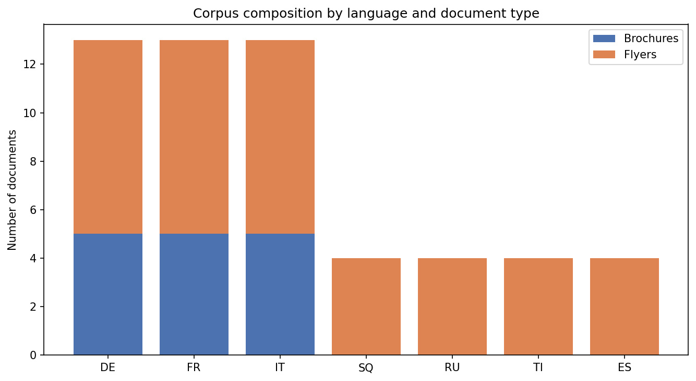
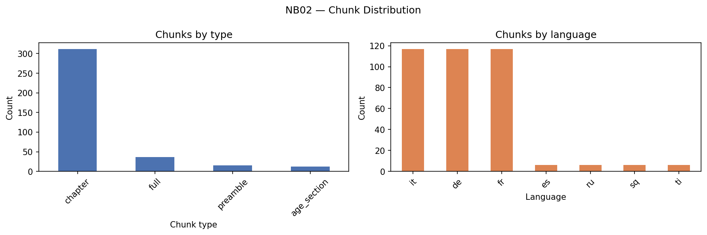
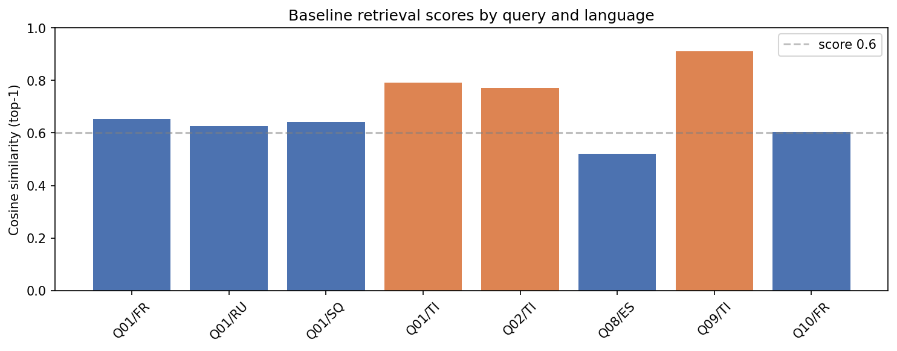
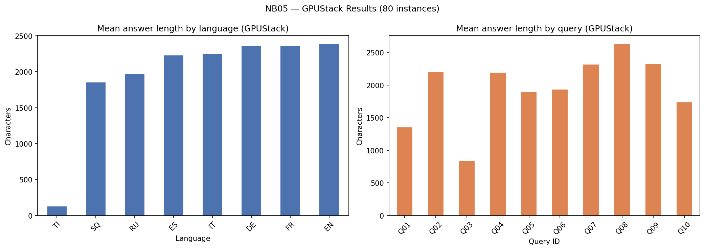

# Cross-lingual RAG system for migrant parents in Switzerland
## CAS NLP 2025 — University of Bern

**Author**: Olga Bobrowska-Braccini
**Email**:olga.bobrowska@students.unibe.ch
**Date**: June 2026

## Abstract

This project presents a cross-lingual retrieval-augmented generation (RAG) system
designed to provide media literacy guidance to migrant parents in Switzerland.
While basic guidance from the Jugend und Medien federal corpus exists in 16
languages, the detailed and regularly updated content — including thematic
brochures covering artificial intelligence and deepfakes (2024 edition) — is
available in German, French, and Italian only. The system enables parents to
query this content in minority languages (Albanian, Russian, Tigrinya, Spanish)
and receive source-grounded answers in an accessible register.

The pipeline combines multilingual sentence embeddings
(paraphrase-multilingual-MiniLM-L12-v2), ChromaDB vector retrieval, and a
large language model (qwen3:8b via Ollama for local development /
gpt-oss-120b via UniBE GPUStack for production inference).
Structural chunking preserves document semantics across four chunk types
(chapter, preamble, age_section, full). Query expansion via the system prompt
bridges the register gap between natural parental language and institutional
vocabulary in the source corpus.

Evaluation uses the RAGAS framework (faithfulness) on 80 instances
(10 queries × 8 languages) using UniBE GPUStack infrastructure.
Faithfulness score: 0.78. context_precision could not be computed due to
a RAGAS 0.4.3 framework constraint. Cross-lingual retrieval is confirmed
for all target languages. Tigrinya produces the highest similarity scores (up to 0.91), attributable
to the distinctive position of Ethiopic script in the embedding space.

## Table of contents

1. Introduction
2. Data
   - 2.1 Corpus description
   - 2.2 Publication dates
   - 2.3 Coverage and limitations
   - 2.4 Language selection
   - 2.5 Preprocessing and chunking strategy
3. Exploratory data analysis
   - 3.1 Corpus composition
   - 3.2 Chunk distribution
   - 3.3 AI coverage in corpus
4. NLP pipeline
   - 4.1 Architecture overview
   - 4.2 Evaluation query set
   - 4.3 Embedding model
   - 4.4 Vector retrieval (ChromaDB)
   - 4.5 Query expansion
   - 4.6 Generation
5. Results
   - 5.1 Cross-lingual retrieval
   - 5.2 Tigrinya finding
   - 5.3 Register gap — Q03 and Q04
   - 5.4 RAG generation baseline
   - 5.5 RAGAS evaluation
6. Discussion
   - 6.1 Cross-lingual retrieval as a viable approach
   - 6.2 The register gap as a structural finding
   - 6.3 Tigrinya: strong retrieval, failed generation
   - 6.4 Limitations
7. Ethics
   - 7.1 What this system is and is not
   - 7.2 Data and privacy
   - 7.3 Output validation limitations
   - 7.4 Hallucination and knowledge leakage risk
   - 7.5 Societal positioning
8. Conclusion and outlook
   - 8.1 Summary
   - 8.2 Key findings
   - 8.3 Priority extensions
   - 8.4 Broader implications
9. References
10. Acknowledgements

---

## 1. Introduction

Switzerland counts a substantial and linguistically diverse resident population
of foreign origin. Access to official information in one's own language is
uneven: while federal and cantonal institutions have progressively expanded
multilingual communication, specialised guidance — particularly in domains
requiring sustained reading and nuanced understanding — remains concentrated
in the three national administrative languages.

The first trajectory is linguistic. It spans over two decades of multilingual
translation practice, recently extended to subtitling, a DESS/MAS in
computer assisted translation (UniGE, Department of Multilingual Computing,
2005), and professional experience in Swiss federal multilingual institutional
communication (Federal Office for Public Health / Infodrog).

The second is a long-term engagement in adult education and integration
support in the Canton of Bern. This engagement began through language teaching
in a structured Italian-Swiss work integration programme for Italian-speaking
women (Donne Lavoratrici) and volunteer conversation partnership for migrants
within Multimondo (Bienne) programmes, and progressively
expanded into a broader andragogical practice, formalised by a federal adult
educator certificate (SVEB, 2020): teaching at UNITRE Berna, work integration
mentoring (Multimondo), career mentoring for graduating students at the
University of Geneva, and the design and teaching of targeted courses for
migrant parents at famira, where I am joining the board in August 2026.

It was also in Bern, and not in Geneva, that the reality of the migrant
experience — and the information gaps it produces — became directly visible
to me, notably through an internship in 2015 with Web for Migrants, a
Bern-based organisation managing Migraweb, an information platform available
in 18 languages, designed by migrants for migrants.

This project originated at the intersection of these two trajectories.
The disappearance of Migraweb — active from the mid-2000s and still
consulted around 2020, before progressively disappearing as municipal
multilingual services expanded — illustrates a broader pattern. The
progressive expansion of multilingual municipal information services
in the early 2020s — partly driven by the 2019 revision of Swiss
integration law (LEI, Loi sur les étrangers et l'intégration), which
formalised cantonal obligations to provide integration support — likely
contributed to Migraweb's abandonment. As institutional multilingual
content became available through official channels, the platform lost
its unique position without securing the funding needed to maintain it.
The domain was eventually repurchased by an unrelated commercial
operator by 2024. The CAS NLP 2025 programme at the University of Bern,
and specifically Module 6 (retrieval-augmented generation), provided
the technical framework to approach this problem computationally.

The choice of target languages — Albanian (SQ), Russian (RU), Tigrinya
(TI), and Spanish (ES) — reflects the communities I most frequently
encountered through this professional engagement. English (EN) is
included in the evaluation set as an additional test language. No
English-language corpus documents were indexed — a deliberate choice
reflecting the project scope. English queries retrieve German, French
or Italian chunks through cross-lingual embedding, demonstrating that
the retrieval mechanism functions independently of the query language.
Their presence in Switzerland and relevance to the corpus are discussed
in Section 2.

The specific focus — media literacy guidance for parents — reflects both
the availability of a structured, high-quality multilingual corpus
(Jugend und Medien) and a documented information density gap: detailed,
regularly updated content exists in German, French, and Italian only,
while minority-language versions remain limited to basic summaries
dating from 2020.

The system enables parents to query the official Swiss corpus in their
own language and receive source-grounded answers in an accessible
register. It does not translate documents: it retrieves semantically
relevant content across languages and generates a response in the query
language. A query in Tigrinya can retrieve a relevant chunk in German;
the response is generated in Tigrinya.

The report is structured as follows: Section 2 describes the corpus and
preprocessing strategy. Section 3 presents exploratory data analysis.
Section 4 details the NLP pipeline. Section 5 reports results. Sections 6
and 7 discuss findings and ethical considerations. Section 8 concludes
with an outlook on extensions and deployment.

---
## 2. Data

### 2.1 Corpus description

The knowledge base draws on the Jugend und Medien corpus, the Swiss federal
reference on media literacy for families, produced by the Federal Social
Insurance Office (OFAS) and distributed via www.jugendundmedien.ch.
The corpus comprises several document types with distinct structural and
linguistic profiles.

Thematic brochures (15 documents) provide detailed, regularly updated guidance
on topics including screen time, cyberbullying, online safety, and — in the
2024 edition — artificial intelligence and deepfakes. Brochures are available
in German, French and Italian only, and follow a numbered chapter structure.

Standard flyers provide condensed guidance organised by child age group
(0-7, 6-13, 12-18) and exist in up to 16 languages. For all four selected target
languages (Albanian, Russian, Tigrinya, Spanish), the corpus includes also the
consolidated extended document (jm-f-ext), covering all three age groups
in a single file and containing additional explanatory paragraphs beyond
the standard flyer format. These documents date from May 2020 and were
selected as the richest available source material in each target language.

Easy Language flyers (DE/FR/IT, 2020) are human-authored simplifications of
the standard content, written at approximately B1 level. They serve a
methodological function: as institutional reference simplifications, they
allow qualitative comparison with LLM-generated output in target languages.

Image rights flyers (DE/FR/IT, 2021) address the specific topic of sharing
photos online. Structured as a 10-question decision checklist, they exist
in two versions: one for parents (children's photos) and one for young people.
Available in national languages only.

The corpus reflects a structural tension in Swiss public communication on
media literacy. Flyers use a simple, accessible register designed to be
understood by parents. Brochures use precise technical vocabulary written
for professionals. The RAG system addresses exactly this gap: parents ask
questions naturally, in their own language and register, while the relevant
knowledge is encoded in institutional vocabulary. This is not a corpus
defect but a reflection of actual Swiss institutional communication
structures. Query expansion via the system prompt is therefore a
structurally necessary step, not a workaround.

See Section 2.5 for language selection decisions. See Section 2.2 for corpus
dates and temporal limitations.

### 2.2 Publication dates

PDF metadata extraction via PyMuPDF revealed a distinction between editorial
dates and PDF generation dates:

- Brochures "Empfehlungen" FR: PDF generated September 2025
  (editorial date October 2024, 8th edition)
- Brochures "Empfehlungen" DE/IT: PDF generated March 2025
  (editorial date 2024)
- Standard flyers (all languages): June 2020
- Extended flyers (SQ/RU/TI/ES): May 2020
- Easy Language flyers: 2020
- Image rights flyers: November 2021

Document filenames use editorial years as stated in the colophon;
PDF generation dates are documented here for precision.

### 2.3 Coverage and limitations

The multilingual flyers date from 2020. Given significant changes in the
digital media landscape since then — including the mass adoption of generative
AI and the evolution of platforms such as TikTok — these versions no longer
reflect the current state of the field. Each document was verified against
the Jugend und Medien website before indexing; where no update was available,
the 2020 version was retained with an explicit caveat in the system prompt.

Two topic-specific gaps apply to all non-national languages across the
full Jugend und Medien platform. Guidance on artificial intelligence exists
only in the 2024 brochures, available in German, French and Italian.
Image rights flyers are equally absent from all non-national languages —
a structural editorial decision reflecting the intended audience segmentation
of the platform.

As of mid-2026, the most recently updated materials in the corpus are the
2024 thematic brochures (PDFs regenerated in early 2025), available in
German, French and Italian only. No update to the minority-language flyers
has been published since 2020. This six-year gap, combined with the
language gap, defines the information access problem this project addresses.

### 2.4 Language selection

The corpus covers three source languages (German, French, Italian), three
primary target languages (Albanian, Russian, Tigrinya), one control
language (Spanish), and one evaluation-only language (English).

**Italian** occupies a dual role: it exists as a source language with full
brochure coverage, but also functions as a vehicular language for non-native
speakers in Switzerland — particularly Latin Americans and Romanians — who
use it as a community integration language. Spanish was added
as a second control language precisely to keep these two functions separate.

**Albanian (SQ)** is a large established community in Switzerland with
Latin script, well-represented in multilingual embedding models.

**Russian (RU)** was selected not primarily for the Ukrainian refugee
population (generally well-educated and digitally equipped) but as
representative of Russian-speaking communities from Central Asia and the
Caucasus — less visible and less served by existing Swiss integration tools.
Cyrillic script adds script diversity to the evaluation. The author has
extensive passive competence, supported by full Polish competence.

**Tigrinya (TI)** represents a significant asylum-seeker group in
Switzerland. Its Ethiopic script (Ge'ez) and low-resource status in standard
language models make cross-lingual retrieval particularly important and the
project's contribution most significant for this language. Black-box language
for output validation.

**Spanish (ES)** covers the large Latin American community in Switzerland
and serves as a control language. The author has extensive passive competence,
supported by full Italian competence.

**English (EN)** is included in the evaluation set only. No English-language
documents were indexed in the corpus — a deliberate choice reflecting
the project scope. English queries retrieve source-language chunks
through cross-lingual embedding.

*Table 1 — Project languages: role, script and validation status*

| Language | Role | Script | Validation |
|----------|------|--------|------------|
| DE | Source | Latin | Full |
| FR | Source | Latin | Full |
| IT | Source / vehicular | Latin | Full |
| EN | Evaluation only | Latin | Full |
| SQ | Target | Latin | None |
| RU | Target | Cyrillic | Extensive (passive) |
| TI | Target | Ethiopic | None |
| ES | Control | Latin | Extensive (passive) |

### 2.5 Preprocessing and chunking strategy

Raw documents were extracted from PDF using PyMuPDF. Text was cleaned to
remove colophon blocks (copyright notices, ordering information) identified
by the © symbol.

Chunking follows document structure rather than fixed character limits,
preserving semantic coherence across four chunk types:

- chapter : brochures split on numbered chapter markers
  (two-digit numbers followed by underscore, e.g. 01_, 16_)
- preamble : brochure text preceding the first chapter marker
- age_section : extended flyers split on age-group headers (0-7, 6-13, 12-18).
  Spanish requires a keyword-based fallback (para padres, para jóvenes)
  as age ranges are written in words rather than numerals in that version.
- full : all remaining flyers stored as single chunks

The chunking strategy was designed to accommodate additional languages
without structural changes to the pipeline — only the age-group header
patterns require language-specific adaptation.

The resulting corpus contains 375 chunks across 55 source documents.

## 3. Exploratory data analysis

### 3.1 Corpus composition

The corpus comprises 55 source documents across 7 languages.
German, French and Italian each include 5 thematic brochures and 8 flyers
(3 standard age-group flyers, 3 Easy Language flyers, 2 image-rights flyers).
The four target languages each include 4 flyer documents — 3 standard
age-group flyers and 1 extended flyer (Figure 1, NB01).

*Figure 1 — Corpus composition by language and document type (NB01)*

### 3.2 Chunk distribution

Structural chunking produced 375 chunks across four types (Figure 2, NB02).
The chapter type dominates (approximately 310 chunks), reflecting the
numbered chapter structure of the 15 thematic brochures. Preamble chunks
(approximately 15) correspond to brochure text preceding the first chapter
marker. Age_section chunks (approximately 12) correspond to extended flyers
split on age-group headers. Full chunks (approximately 36) correspond to
all remaining flyers stored as single chunks — standard age-group flyers,
Easy Language flyers, and image rights flyers.

By language, German, French and Italian each contribute approximately
115 chunks — a direct consequence of brochure coverage, which exists
only in these three languages. Target languages contribute between
7 and 9 chunks each, corresponding to their extended and standard
flyer content.

This asymmetry between source and target languages is a structural
feature of the corpus. It directly motivates the cross-lingual retrieval
approach: target-language queries retrieve source-language chunks
to access detailed brochure content not available in the query language.
A complementary scenario — parents querying in basic German, French or
Italian as a vehicular language — was not analysed in this project but
is plausible given the multilingual profiles of the target communities.
Retrieval quality across target languages is discussed in Section 5.

*Figure 2 — Chunk distribution by type (NB02)*

### 3.3 AI coverage in corpus

A targeted search for AI-related terms across all chunks confirmed that
references to artificial intelligence (Künstliche Intelligenz, intelligence
artificielle, intelligenza artificiale) appear exclusively in chapter 16
and chapter 17 of the 2024 thematic brochures — available in German,
French and Italian only. No AI-related content was identified in any
minority-language document.

## 4. NLP pipeline

### 4.1 Architecture overview

The pipeline follows a standard RAG architecture with one structurally
motivated addition — query expansion — at the generation stage.

Query (any of the 8 project languages)
    ↓ paraphrase-multilingual-MiniLM-L12-v2 → embedding (384 dimensions)
    ↓ ChromaDB → cosine similarity → top-5 chunks
    ↓ qwen3:8b (Ollama local) / gpt-oss-120b (GPUStack production)
      — system prompt drives internal query expansion
        (parental phrasing → institutional terms) during generation
    ↓ Response in query language

### 4.2 Evaluation query set

The 10 evaluation queries reflect questions recurrently encountered
in professional practice with migrant parents — notably in digital
literacy and parenting courses at famira (Bern), where topics such
as screen time, social media safety and AI arise naturally in discussion.
Formal needs assessment with this population faces a structural
challenge: the gap between oral comprehension and written expression
means that standard questionnaires do not reliably capture information
needs. The conversational, language-agnostic interface of the RAG
system is designed precisely to bridge this gap.

### 4.3 Embedding model

paraphrase-multilingual-MiniLM-L12-v2 (sentence-transformers), a
12-layer multilingual model supporting 50+ languages, is used
throughout the pipeline for embeddings — for local development and
for the GPUStack-deployed application alike.

qwen3-embedding-0.6b, available via the GPUStack API, was
considered as an alternative production embedding model but was not
adopted: it requires PyTorch 2.4+ (unavailable for local development
on Mac Intel x64, where the maximum available version is 2.2.2), and
switching would require reindexing the entire corpus — not undertaken,
in order to preserve score consistency across all evaluation results.

All chunks and queries are embedded in the same 384-dimensional vector
space, enabling cross-lingual retrieval without translation: a Tigrinya
query and a German chunk can be compared directly by cosine similarity. 
This shared vector space is stored in ChromaDB, described in
Section 4.4.

### 4.4 Vector retrieval (ChromaDB)

Chunk embeddings are stored in a persistent ChromaDB collection
(data/chroma/, collection: jugend_medien). At query time, the query
embedding is compared against all 375 chunk embeddings by cosine
similarity. The top-5 chunks are retrieved regardless of language —
no language filter is applied at retrieval stage.

Source titles are mapped from filenames to human-readable document
titles via a SOURCE_TITLES dictionary (55 entries), used for citation
in generated responses.

### 4.5 Query expansion

The system prompt instructs the model to internally reformulate the
parent's question using institutional vocabulary before answering.
This bridges the register gap identified in Section 3: parental phrasing
does not map to the technical terms used in the corpus. Query expansion
operates at generation level — the model reformulates internally without
exposing the reformulation to the user. The original query embedding is
used for retrieval; a dedicated pre-retrieval expansion step is documented
as a priority extension (Section 8).

### 4.6 Generation

Local development uses qwen3:8b via Ollama (CPU inference, Mac Intel 2020).
Production deployment targets gpt-oss-120b via UniBE GPUStack
(OpenAI-compatible API at gpustack.unibe.ch). The two are drop-in
replacements — only the endpoint URL and model name require updating.

The system prompt (prompts/system_prompt.txt) instructs the model to:
- internally reformulate the query using institutional vocabulary
- answer in the same language as the query
- base the answer strictly on the provided source excerpts
- cite each claim with [source: document title]
- use simple, accessible language suited for a parent
- refer to the official platform if excerpts are insufficient:
  www.jugendundmedien.ch (DE) / www.jeunesetmedias.ch (FR) /
  www.giovaniemedia.ch (IT)

Tigrinya generation requires a stronger multilingual model: qwen3:8b
produces infinite loops when generating in Tigrinya. Testing with
gpt-oss-120b on UniBE GPUStack confirmed that this failure is
model-specific, not language-specific — Tigrinya generation succeeds
with the production model.

## 5. Results

### 5.1 Cross-lingual retrieval

Cross-lingual retrieval was confirmed for all eight project languages.
Queries in Albanian, Russian, Tigrinya, Spanish and English successfully
retrieved relevant chunks in German, French and Italian. The embedding
model maps semantically similar content across languages and scripts into
a shared vector space, enabling direct cosine similarity comparison
between queries and chunks across any language pair — for instance,
a Russian query retrieving a German chunk.

A recurring pattern was observed: French queries retrieve German chunks
as top-1 result in 3 out of 4 cases, despite French equivalents being
available in the corpus. The reason for this preference is not established
— it may reflect stronger German representation in the training data of
paraphrase-multilingual-MiniLM-L12-v2, or other structural factors
not investigated in this project. Retesting with a different embedding
model on GPUStack would require reindexing the entire corpus, which was
not undertaken in order to preserve score consistency across all
evaluation results.

*Figure 3 — Retrieval scores by query and language (NB03)*

*Table 2 — Retrieval scores by query and language (NB03)*

| Query | Language | Top-1 source | Score |
|-------|----------|--------------|-------|
| Q01 | FR | jm-b-2024-recommendations_de (ch.03) | 0.653 |
| Q01 | RU | jm-b-2021-school_it (ch.01) | 0.627 |
| Q01 | SQ | jm-b-2024-recommendations_de (ch.03) | 0.643 |
| Q01 | TI | jm-f-ext_ti | 0.792 |
| Q02 | TI | jm-f-ext_ti | 0.771 |
| Q03 | FR | jm-b-2024-recommendations_de (ch.05) | 0.526 |
| Q04 | FR | jm-b-2024-recommendations_de (ch.20) | 0.564 |
| Q08 | ES | jm-f-2021-image-rights-parents_fr | 0.521 |
| Q09 | TI | jm-f-ext_ti | 0.910 |
| Q10 | FR | jm-b-2024-recommendations_fr (ch.20) | 0.603 |

### 5.2 Tigrinya finding

Tigrinya consistently produced the highest cosine similarity scores
(0.79–0.91), outperforming French, German, Russian and Albanian across
multiple queries.

The extended flyer covering all three age groups is indexed for all
four target languages (Albanian, Russian, Tigrinya, Spanish). The denser
chunk format therefore applies equally to all four — and cannot alone
explain Tigrinya's advantage.

A more likely explanation lies in the script: Ethiopic (Ge'ez) is highly
distinctive in the embedding space. With few other languages sharing this
script in the training data, Tigrinya embeddings occupy an isolated region
of the vector space, reducing interference from other languages and
producing consistently high cosine similarity scores.
This hypothesis requires verification with qwen3-embedding-0.6b on GPUStack.

Despite strong retrieval scores, Tigrinya generation failed with
qwen3:8b — the model produced truncated or incoherent output.
Testing with gpt-oss-120b on UniBE GPUStack confirmed that the
failure was model-specific, not language-specific: Tigrinya generation
succeeds with gpt-oss-120b, producing coherent responses grounded in the
retrieved Tigrinya chunks. The retrieval infrastructure
requires no modification for Tigrinya deployment — only the generation
model needs to be upgraded.

### 5.3 Register gap — Q03 and Q04

Two queries systematically failed to retrieve the most relevant chunks:

Q03 (TikTok minimum age): the query "From what age is it allowed in
Switzerland?" did not retrieve the chunks containing age 13 and TikTok
registration requirements, despite these being present in 29 chunks
including 12 with explicit age references. The failure is semantic:
parental phrasing does not map to institutional vocabulary.

Q04 (cyberbullying): the query "Someone keeps sending mean messages
to my child" retrieved the chapter on legal information and counselling
services rather than the chapter on cyberbullying. The generated response
correctly cited Elternnotruf / SOS Parents (0848 35 45 55) — a real
resource present in the retrieved chunk — but missed the specific
cyberbullying guidance.

Both cases confirm that the register gap between natural parental
phrasing and institutional vocabulary is a structural pipeline challenge,
not a corpus gap. The relevant content exists; the retrieval mechanism
does not reach it with unmodified queries. Query expansion via the
system prompt is the retained solution, documented as a priority for
pre-retrieval implementation (Section 8).

### 5.4 RAG generation baseline

Generation was tested in three stages. First, NB04 provided qualitative
spot-checks across 7 language/query combinations using qwen3:8b (local
CPU, Table 3). Second, NB05 ran a 22-instance subset (10 FR + 12 in minority
languages) for RAGAS evaluation, also on local CPU. Third, NB05 was
rerun on UniBE GPUStack across the full 80-instance dataset
(10 queries × 8 languages) using gpt-oss-120b.

Knowledge leakage occurs when a response draws on knowledge the model
acquired during training — its parametric knowledge — rather than, or
in addition to, the information present in the retrieved corpus
excerpts. One such case was observed in the spot-check (Q04/FR),
flagged in the table below.

*Table 3 — NB04 generation spot-check results*

| Query | Language | Script          | Retrieval | Generation | Leakage |  Notes |
|-------|----------|--------|--------|-----------|------------|---------| 
| Q01 | FR         | Latin           | OK        | OK         |   no    | Corpus gap handled, redirected to official platform |
| Q04 | FR         | Latin           | partial   | partial    |   yes   | Register gap — counselling chapter instead of cyberbullying; cites non-Swiss resources (e.g. antiharcelement.fr) |
| Q09 | FR         | Latin           | OK        | OK         |    no   | Best result overall — deepfakes guidance correct |
| Q09 | SQ         | Latin           | OK        | OK         |    no   | Cross-lingual: SQ query, FR/DE chunks, SQ response |
| Q01 | RU         | Cyrillic        | OK        | OK         |    no   | Correct behaviour, redirected to official platform |
| Q08 | ES         | Latin           |OK         | OK         |    no   | Cross-lingual: ES query, DE image-rights chunk |
| Q01 | TI         | Ethiopic (Ge'ez)| OK        | fail       |    -   | Generation fails (infinite loop) — GPU required |

English was included in the evaluation query set (Section 4.2) but no
English-language corpus documents were indexed — a deliberate design
choice (Section 2.4). English queries rely entirely on cross-lingual
retrieval, retrieving German, French or Italian chunks.

Full generation testing on GPUStack (80 instances) confirmed these
results at scale. Mean answer length by language (Figure 4) shows
Tigrinya responses significantly shorter than other languages,
reflecting the 1000-token limit applied during the production
evaluation run.

*Figure 4 — Answer length by language and query (NB05 GPUStack)*

### 5.5 RAGAS evaluation

RAGAS evaluation (faithfulness metric, legacy API with LangchainLLMWrapper)
was run first on a local subset of 22 instances (10 queries in French plus
3 queries each in Russian, Albanian, Tigrinya and Spanish). All evaluation
calls timed out on local CPU — qwen3:8b via Ollama is insufficient for
parallel RAGAS inference. The returned score was NaN for all instances.

The timeout results are documented as an infrastructure finding rather
than a pipeline failure: the retrieval and generation pipeline is
functional, as demonstrated by the qualitative results in Sections
5.1–5.4.

Subsequently, RAGAS faithfulness evaluation was run on the full
80-instance dataset (10 queries × 8 languages) using UniBE GPUStack
infrastructure. Generation used gpt-oss-120b; the judge was
qwen3-vl-30b-a3b-instruct — a distinct model, eliminating the
self-evaluation bias present in the local baseline evaluation.

**Result: faithfulness = 0.78** (80 instances, 6 validation errors).

Six instances returned JSON validation errors from the judge model,
likely due to response length. These instances were excluded from
the score computation.

A faithfulness score of 0.78 indicates that approximately 78% of
claims in the generated responses are grounded in the retrieved
source chunks. The remaining 22% represent knowledge leakage —
the model supplementing corpus content with parametric knowledge,
as documented qualitatively in Section 5.4.

context_precision could not be computed. RAGAS 0.4.3 — the latest
available version at the time of writing — requires an InstructorLLM
wrapper for this metric, which is incompatible with OpenAI-compatible
API endpoints such as GPUStack. This is a constraint of the current
RAGAS release, not of the pipeline.

## 6. Discussion

### 6.1 Cross-lingual retrieval as a viable approach

The results confirm that multilingual sentence embeddings enable
effective cross-lingual retrieval across diverse scripts and language
families. A single embedding space supports queries in Latin, Cyrillic
and Ethiopic scripts without language-specific adaptation. This is the
core technical contribution of the project: parents can interact in
their own language while the system transparently accesses content
in a different language.

### 6.2 The register gap as a structural finding

The retrieval failures observed for Q03 and Q04 are not corpus defects
— they reflect a genuine structural tension between the natural language
of the target users and the institutional vocabulary of the knowledge
base. This tension is not specific to this project: it characterises
any RAG system deployed across a register boundary.

Query expansion at generation level partially addresses this gap.
However, as documented in Section 5.3, the original query embedding
is used for retrieval — meaning the expansion comes too late in the
pipeline. Pre-retrieval query expansion, where the query is reformulated
before embedding, is the priority extension identified for this system.

### 6.3 Tigrinya: Strong retrieval, failed generation

The Tigrinya results illustrate a distinction that is often overlooked
in multilingual NLP evaluations: retrieval quality and generation
quality are independent properties of a pipeline. A system can retrieve
correctly and generate poorly — or vice versa. For Tigrinya, retrieval
is strong; generation fails with qwen3:8b but succeeds with gpt-oss-120b.
This has practical implications: the pipeline is production-ready for
Tigrinya deployment on GPUStack. The retrieval infrastructure does not
need to be rebuilt.

### 6.4 Limitations

Several limitations affect the scope of the results.

RAGAS faithfulness was computed on GPUStack: score = 0.78
(80 instances — full evaluation dataset), using qwen3-vl-30b-a3b-instruct
as independent judge — a weaker but distinct model from the generator
(gpt-oss-120b), eliminating self-evaluation bias.

Six validation errors occurred, likely due to response length. 

context_precision could not be computed — RAGAS 0.4.3 requires an InstructorLLM wrapper
incompatible with GPUStack endpoints.

The minority-language corpus dates from 2020 and does not cover
artificial intelligence — a significant gap given that AI literacy
is increasingly relevant for parents navigating the current digital
landscape.

Output validation in Tigrinya relied on structural indicators
for the local baseline. GPUStack testing confirmed generation
quality with gpt-oss-120b; semantic validation by a native speaker
remains necessary before deployment. For Albanian, the single
tested query (Q09/SQ) was judged sufficient for a proof-of-concept
demonstration at this stage.

## 7. Ethics

### 7.1 What this system is and is not

This project is an academic proof-of-concept prototype. It demonstrates
the technical feasibility of cross-lingual RAG for a specific social
use case. It is not a deployable product, not a validated information
service, and not a substitute for professional advice or institutional
guidance.

The system retrieves content from official Swiss federal documents and
generates responses grounded in those sources. It does not provide
medical, legal or psychological advice. Where corpus content is
insufficient, the system redirects users to the official platform.

### 7.2 Data and privacy

All corpus documents are publicly available Swiss federal publications.
No personal data is collected or processed. Local development uses
Ollama (CPU, no external API calls). Production deployment on UniBE
GPUStack keeps all data within Swiss academic infrastructure.
No user data is stored or logged.

### 7.3 Output validation limitations

Generated responses in Tigrinya and Albanian could not be validated
semantically within my linguistic competence. The system
should not be deployed for these languages without prior validation
by qualified native speakers.

For all languages, the system may produce responses that are
technically grounded in the retrieved chunks but incomplete,
misleading or insufficiently nuanced for the specific situation
of a parent. The register of generated responses — while accessible
— has not been evaluated against established Easy Language standards.

### 7.4 Hallucination and knowledge leakage risk

The system is instructed to base answers strictly on retrieved corpus
excerpts. RAGAS faithfulness evaluation (score = 0.78, GPUStack, 80
instances) is the primary mechanism for systematic detection of
unfaithful responses.

The RAGAS judge (qwen3-vl-30b-a3b-instruct) is distinct from the
generator (gpt-oss-120b), eliminating self-evaluation bias — the judge
has no prior exposure to its own outputs when assessing faithfulness.

A concrete instance of knowledge leakage was identified in the
qualitative spot-check (Section 5.4, Q04/FR): the response cited
non-Swiss support resources alongside corpus-grounded content.

### 7.5 Societal positioning

The system addresses a real and documented information gap. It does
not replace existing Swiss integration services or counselling
resources — it complements them by making official content accessible
in languages that institutional channels do not reach.

The choice of target languages reflects communities encountered through
direct professional experience. It is not a comprehensive representation
of all linguistic minorities in Switzerland, and the system should not
be presented as such.

## 8. Conclusion and outlook

### 8.1 Summary

This project demonstrates that a cross-lingual RAG system built on
publicly available federal documents can provide meaningful media
literacy guidance to parents in minority languages. Cross-lingual
retrieval was confirmed for all eight project languages. The system
correctly handles corpus gaps by redirecting to the official platform.
The register gap between natural parental phrasing and institutional
vocabulary was identified as the primary retrieval challenge and
addressed through query expansion at generation level.

### 8.2 Key findings

Three findings stand out:

First, Tigrinya retrieval performance exceeds expectations — likely
due to the distinctive position of Ethiopic script in the embedding
space. This is an empirical finding with implications for low-resource
language NLP more broadly. Full RAGAS evaluation on UniBE GPUStack
(80 instances) yielded a faithfulness score of 0.78, and Tigrinya
generation worked correctly with gpt-oss-120b — validating the
production pipeline described in Section 4.6.

Second, the register gap is not a corpus defect — the corpus is well-structured
for its intended audience (professionals and educators). It reflects
the communication design of Swiss public institutions, where detailed
content is addressed to specialists, not to parents directly. Mediation
at the query level is therefore necessary to bridge the gap between
how parents naturally ask questions and how knowledge is encoded
in institutional documents.

Third, retrieval and generation quality are independent. A language
can be well-served by retrieval while remaining inaccessible at
generation level. Infrastructure investment (GPU access, stronger
multilingual models) directly unlocks generation for currently
failing languages.

### 8.3 Priority extensions

Pre-retrieval query expansion emerged as a finding of this project's
evaluation (Section 5.3), not as part of its initial design. Addressing
it would require restructuring the pipeline — adding a query
reformulation step before embedding — and re-running the full
evaluation to assess its impact on retrieval. This constitutes a new
iteration cycle and is identified here as the top priority for future
work, alongside the following.

Regarding a possible future corpus enrichment, the depth asymmetry
between source and target languages is structural — each target
language has approximately 12 indexed chunks compared to 115 for
German, French and Italian. Within Switzerland, cantonal integration platforms (hallo-bern.ch,
hallo-baselland.ch) and the Swiss Institute for Children's and Youth
Media (SIKJM / ISJM / ISMR) programme "Tell Me a Story" already
publish content on parenting in Tigrinya and other minority languages. Beyond Switzerland, the Australian eSafety
Commissioner publishes Tigrinya advice sheets on social media, online
gaming and cyberbullying. These represent natural extensions of the
current corpus. Additional target languages already present in the
Jugend und Medien corpus — Arabic, Somali, Portuguese, Turkish, Farsi
— could be added with corpus indexing and generation testing only;
the retrieval infrastructure is already in place. Finally, the
evaluation query set could itself be extended through regular surveys
with target communities, for more representative coverage of parental
information needs.

### 8.4 Broader implications

The information gap addressed by this project is one of depth, not
absence: basic guidance exists in up to 16 languages, but detailed
content on artificial intelligence, cyberbullying and image rights
exists only in German, French and Italian — a pattern consistent
with Swiss institutional communication more broadly. This depth gap
is technically addressable with existing open-source tools and
publicly available federal content. The barrier is infrastructural
and institutional. Sustainable deployment would require maintenance,
native-speaker validation, and corpus updates aligned with the
publication cycle of Jugend und Medien.

## 9. References

### Data and legal sources

Office fédéral des assurances sociales (OFAS). (2020–2024).
Jeunes et médias — La plateforme nationale de promotion des
compétences médiatiques [National platform for media literacy].
<https://www.jugendundmedien.ch> / <https://www.jeunesetmedias.ch> / <https://www.giovaniemedia.ch>

Confédération suisse. (2019). Loi fédérale sur les étrangers et
l'intégration (LEI) [Federal Act on Foreign Nationals and
Integration (FNIA)]. Fedlex.
<https://www.fedlex.admin.ch/eli/cc/2008/746/fr>

### NLP models

Reimers, N., & Gurevych, I. (2020). Making monolingual sentence
embeddings multilingual using knowledge distillation.
Proceedings of EMNLP 2020, 4512–4525.
<https://arxiv.org/abs/2004.09813>

Es, S., James, J., Anke, L. E., & Schockaert, S. (2023).
RAGAS: Automated evaluation of retrieval augmented generation.
<https://arxiv.org/abs/2309.15217>

### Software

Chroma. (2024). ChromaDB (v0.4). <https://www.trychroma.com>

Hunter, J. D. (2007). Matplotlib: A 2D graphics environment.
Computing in Science & Engineering, 9(3), 90–95.

LangChain AI. (2024). LangChain (used as RAGAS dependency).
<https://github.com/langchain-ai/langchain>

McKinney, W. (2010). Data structures for statistical computing
in Python. Proceedings of the 9th Python in Science Conference, 56–61.

Ollama. (2024). Ollama . <https://ollama.com>

PyMuPDF. (2024). PyMuPDF (v1.24) 
<https://pymupdf.readthedocs.io>

Streamlit Inc. (2024). Streamlit (v1.57) .
<https://streamlit.io>

## 10. Acknowledgements

My deepest thanks go to my family, in particular to my son Bruno and
my husband Saverio, for being there throughout this journey — *forte* or *piano*, as needed
— and for all the small everyday things that
made room for this work to happen.

Thanks to the CAS NLP teaching team for their guidance throughout
the programme, and to my classmates for the discussions and shared
work across the various modules — even when our individual paths
and paces diverged. And to everyone with whom I shared the early
discussions framing this final project: thank you.

I am also grateful to my colleagues at famira, and to the team at
Multimondo, where I served as a mentor in their work-integration
programme — both contexts in which this project's evaluation queries
are grounded, drawn from years of shared practice with migrant parents.

More broadly, this project would not exist without a longer chain of
encounters — organisations and programmes that, over the years,
brought the realities addressed here into view: 
UNITRE Berna, Web for Migrants, Infodrog and the City of Bern's Bernetz
programme, among others.
